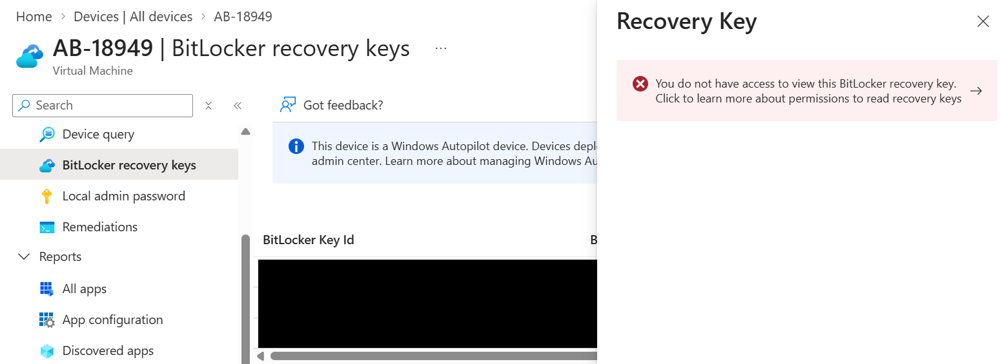
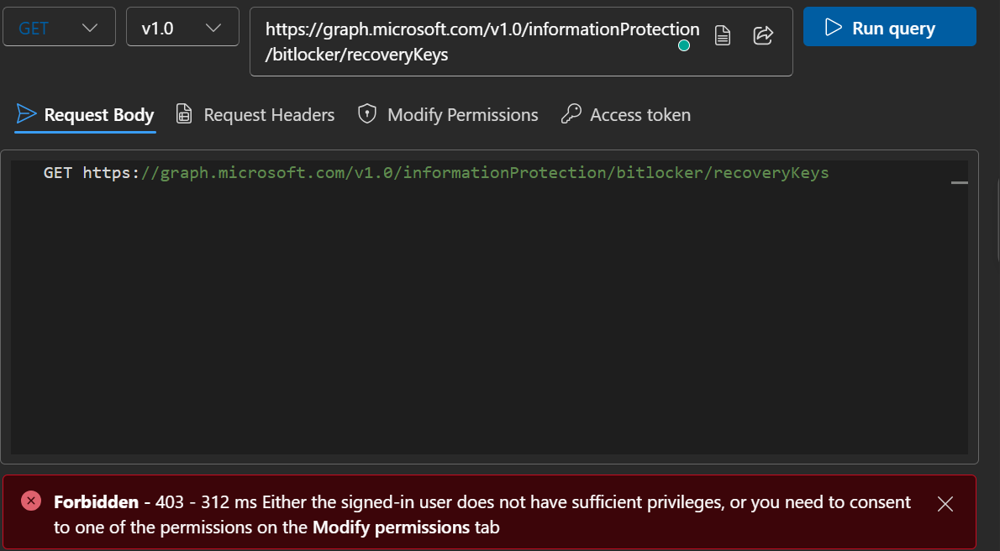
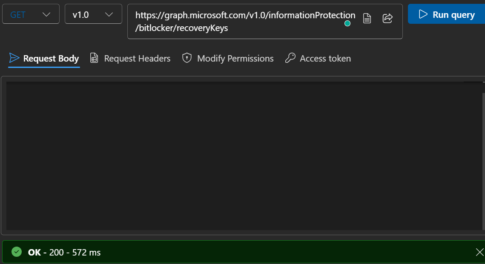
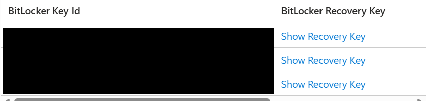
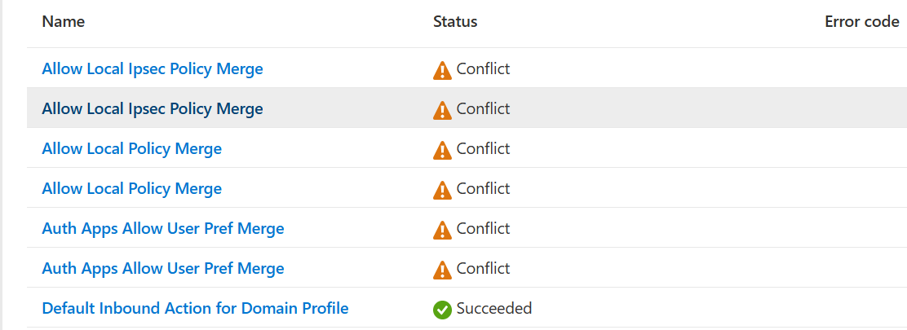
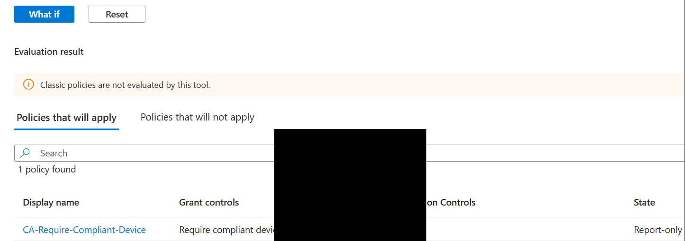
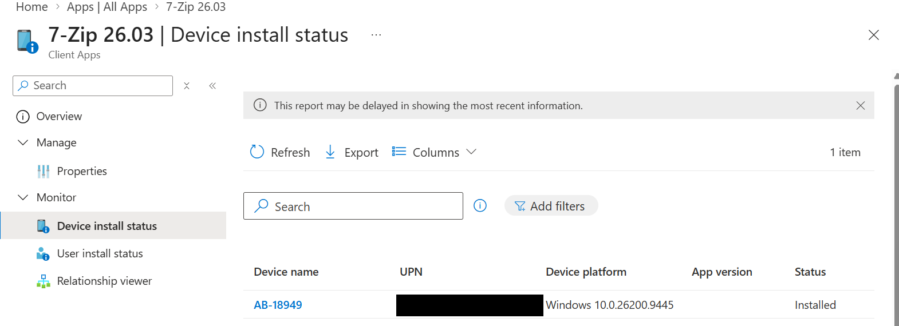
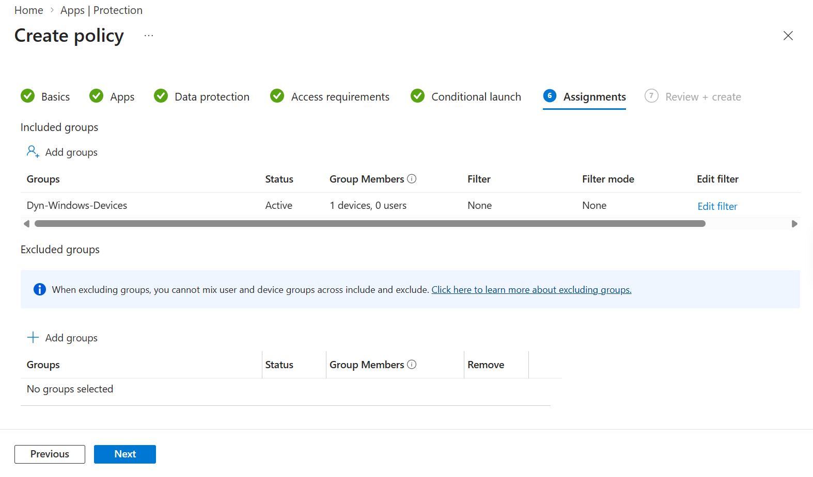

# Lab log

The running record of the lab, kept day by day: what was built, what broke, the exact error text,
what was checked, the cause, the fix, and what it taught. Failures are kept on purpose.

Personal lab environment, not production. Tenant name, tenant ID and device serials are replaced
with placeholders.

---

## Day 1, Monday 17 August

**Built:**
- Microsoft 365 tenant `labtenant.onmicrosoft.com`, global admin `admin@labtenant.onmicrosoft.com`
- Intune Suite Trial activated, 250 licences, expires 15 Nov 2026
- Entra ID P2 Managed Trial activated, 100 licences
- Hyper-V enabled on the host, `W11-CORP-01` created: Gen 2, TPM enabled, Secure Boot on, 64 GB dynamic disk, Default Switch

**Broke:**
1. "Enregistrer ou imprimer" on the signup confirmation did nothing when clicked
2. Entra ID P2 showed Actif in Vos produits but 0 of 100 licences assigned
3. `Start-VM` refused to launch the VM

**Error text:**
```
Impossible d'allouer 4096Mo de mémoire RAM: Insufficient system resources
exist to complete the requested service. (0x800705AA)
```

**Cause:**
1. Popup or print dialog blocked by the browser. Nothing was actually wrong.
2. Buying a subscription and assigning it to a user are separate operations. Tenant-level Actif does not give the user the capability.
3. Host had 2.63 GB free of 15.46 GB, Chrome holding 4,570 MB across 32 processes. Hyper-V reserves the full **startup** memory up front, before the VM runs. Dynamic memory's minimum is irrelevant at boot.

**Fix:**
1. Recorded the credentials manually. Ctrl+P to PDF as a backup.
2. Assigned the Entra ID P2 licence to the admin user, then signed out and back in so the token picked up the new capability.
3. Closed Chrome tabs and lowered startup memory from 4 GB to 3 GB, keeping dynamic 1 to 6 GB.

**Learned:**
- Active at tenant level and assigned at user level are two different things. An unassigned licence is the first thing to check when a feature is "bought" but missing, and it is the same root cause behind Intune enrolments that fail for no visible reason.
- Licence changes need a fresh sign-in before they take effect. Looks like a bug, is not.
- Hyper-V reserves startup RAM up front. On a 16 GB host, startup allocation is the number that decides whether a VM boots at all.
- Windows 11 in Hyper-V needs Generation 2, and TPM has to be switched on explicitly with `Set-VMKeyProtector` before `Enable-VMTPM`. Without it, setup fails with "This PC can't run Windows 11" and no useful detail.

---

## Day 2, plan day Tuesday 18 August, actually done Wednesday 19 August

One day behind the plan. Recording it rather than hiding it.

**Built:**
- 10 users created by hand in the Entra portal, then deleted
- 20 users created with PowerShell 7 and the Microsoft Graph SDK, with job title, department and usage location CH set on all of them
- 5 security groups, all created in the cloud, none synced from on-prem:
  - Assigned: `IT-Admins` (5 members), `All-Corp-Devices` (empty), `All-BYOD` (empty)
  - Dynamic Device: `Dyn-Windows-Devices`, `Dyn-Android-Devices`
- Intune Administrator role assigned to Anna Test, then signed in as her to see what the role can and cannot do
- Device settings, tenant wide: join restricted to `IT-Admins`, MFA to join left off, maximum devices per user lowered from 50 to 5

Dynamic rules used:
```
device.deviceOSType -eq "Windows"
device.deviceOSType -startsWith "Android"
```

**Broke:**
1. First user would not save. Validation failed on the Basics tab.
2. Created `aul.test@labtenant.onmicrosoft.com` instead of `paul.test`. The first letter went missing and nothing complained.
3. Typed the job title as "vice Desk Analyst" instead of "Service Desk Analyst". Same first characters missing.
4. Created `IT-Admins` and selected 5 members during creation, but the group came out with 0 members.
5. On the device settings page, "Members allowed to join devices" showed "No results" and I thought the group was not there.
6. Signed in as Anna and could not change anything on the device settings page.

**Error text:**
```
Validation failed. Required information is missing or not valid for following tabs: Basics.
```
Anna got a permission message when she tried to save, telling her she did not have enough permission.

Numbers 2, 3 and 4 produced **no error at all**. Nothing on screen, nothing in the portal.

**Cause:**
1. Display name was empty. It is a mandatory field so the rule catches it. What tricked me is that Mail nickname fills itself in from the UPN but Display name does not, so the name area looks like it filled itself when only half of it did. The portal also points at the tab, not at the field.
2. and 3. The first characters were lost on input. Nothing could catch it because `aul.test` is a perfectly valid UPN. It is well formed, it is just not the value I wanted.
4. The member picker inside the create form did not commit the selection.
5. That panel shows what is currently selected, not a search of the directory. It said "No results" because nothing had been added yet.
6. Anna has Intune Administrator. That role can read the device settings page but not change it. Changing it needs Cloud Device Administrator.

**Fix:**
1. Went back to the Basics tab and filled in the display name.
2. Did not fix it. Deleted all 10 manual users and created 20 with the script instead.
4. Added the members afterwards from the group's own Members page, which worked.
5. Clicked **+ Add** to open the actual picker, then found `IT-Admins` straight away.
6. Nothing to fix. That is the role working as intended.

**Learned:**

Manual against scripted. Ten users by hand took me **10 minutes**. Twenty users by script took **7.3 seconds**. That is 60 seconds per user against 0.37 seconds, roughly **162 times faster**. But the speed is not the main thing. By hand I produced **one silent error in ten accounts**. The script produced **zero in twenty**, because the lowercase rule and the usage location are written once and applied to everything. Doing it by hand is fine for a team of two or three. At fifty or five hundred it is not a question, and in a real job the list usually arrives as a CSV anyway, so there is no reason to retype anything.

Two different kinds of failure, and the difference matters. The blank display name was **loud**. It stopped me, so it cost me a minute. `aul.test` was **silent**. It let me carry on and would have surfaced later as a user who cannot sign in and whose mail address is wrong. The loud one is the cheap one. The silent one is the expensive one, and it is the one automation removes.

Tenant wide against assigned. Everything on the Device settings page applies to the **whole tenant**. Setting maximum devices to 5 applies to every user including me. That is different from a compliance policy or a configuration profile, which you assign to a specific group and which only affects that group. Tenant wide is where you break everyone at once.

Least privilege. I gave Anna Intune Administrator rather than Global Administrator because it is the smallest role that covers the job. If her account is compromised the damage is limited to Intune instead of the whole tenant.

**Open for Day 3:** both dynamic groups have valid rules and 0 members because there are no enrolled devices yet. I could not measure how long a dynamic group takes to populate. Carry that to Day 3 when `W11-CORP-01` is Entra joined.

---

# Days 9 to 14, 27 August to 9 September 2026

Condensed. Only the failures, because the successes are in `06_SKILLS_OBTAINED.md` and in
`tutorials/`.

---

## Day 9. Windows LAPS returned 0x80070190 and the portal said nothing useful

**Attempt:** built a Windows LAPS policy, assigned it, synced the device, and tried to retrieve the
local administrator password from the device blade.

**Error text:**
```
0x80070190
```

The Intune policy reported as successfully applied. The device blade showed no password.

**Cause:** found by reading the device event log rather than the portal.

```powershell
Get-WinEvent -LogName "Microsoft-Windows-LAPS/Operational" -MaxEvents 15
```

Event 10059: *"Local admin password solution is not enabled for this tenant."*

There is a tenant-level switch in Microsoft Entra that turns LAPS on for the directory. It is
mentioned in neither the Intune LAPS blade nor the policy itself. Until it is on, the policy applies
correctly to the device, the device tries to escrow the password, and the directory refuses it.

**Fix:** turned the tenant switch on, ran `Invoke-LapsPolicyProcessing` on the device, password
appeared.

**Learned:** a policy reporting success is a statement about delivery, not about outcome. The device
event log was the only place carrying the real reason. Third tenant-level switch this month that
lives nowhere near the feature it controls, after the compliance default and the Windows diagnostic
data toggle.

---

## Day 11. A dynamic group cannot be its own exception

**Attempt:** build three update rings (pilot, broad, critical) with non-overlapping targeting. The
existing pilot ring was assigned to `Dyn-Windows-Devices`, the dynamic group catching every Windows
device.

**Error text:** none. Excluding a group from itself is meaningless, so there is nothing to fail.

**Cause:** the design was wrong, not the tool. One dynamic group holding everything is correct for
the broad ring. A pilot is by definition a hand-picked subset, and no membership rule expresses
"these three machines".

**Fix:** created `Grp-Ring-Pilot` as an **assigned** security group, added the lab device, reassigned
the pilot ring to it, then included `Dyn-Windows-Devices` on the broad ring and excluded
`Grp-Ring-Pilot`.

**Learned:** dynamic for the mass, assigned for the exceptions. Adding a machine to the pilot group
now moves it between rings with no rule edits anywhere.

Also confirmed: Intune has no priority ranking for update rings. Two rings targeting one device is a
conflict, the conflicting settings are not written, and the device silently keeps its previous
values. Overlapping rings look exactly like "Intune is not working".

---

## Day 11. A policy whose name did not match what it deployed

**Attempt:** created a feature update policy named `Feature-Pin-24H2`, generated the report.

**Error text:** none. The report showed the policy as healthy.

**Cause:** the Versions column read **Windows 11, version 25H2**. The name was a label typed by a
human. The version was what the service would actually do.


**Fix:** renamed the policy to match its behaviour.

**Learned:** this is how a version pin fails quietly for months in a real tenant. Nobody reads the
version column, they read the name. The service's own reporting outranks the label.

---

## Day 13. The antivirus policy was enforcing an insecure value

**Attempt:** built a Defender Antivirus policy, assigned it, synced, verified with
`Get-MpPreference`.

**Error text:** none. The policy reported as successfully applied.

```
PUAProtection           : 0
DisableLocalAdminMerge  :
SignatureUpdateInterval : 4
CloudBlockLevel         : 2
CloudExtendedTimeout    : 50
SubmitSamplesConsent    : 1
```

**Cause:** four values were present on the device, which proved delivery, assignment and licensing in
one step, and therefore located the fault inside the policy rather than in the sync. Opening the
policy showed potentially unwanted application protection explicitly set to **off**.

Worse than unconfigured. An explicit "off" overrides whatever the device would otherwise do, and
still reports as applied.


**Fix:** set it to block, saved, synced. `PUAProtection` moved from 0 to 1.

**Learned:** the diagnostic order is the whole point. Prove the policy arrived, then question its
contents. Most people do it backwards and spend an hour on sync.

---

## Day 13. Select-Object invented a setting that did not exist

**Attempt:** read `DisableLocalAdminMerge` out of the registry to confirm it had applied.

```powershell
Get-ItemProperty "HKLM:\SOFTWARE\Microsoft\PolicyManager\current\device\Defender" | Select-Object DisableLocalAdminMerge, PUAProtection, AllowOnAccessProtection
```

**Error text:** none. Three column headers printed with nothing under them, which reads exactly like
three unset settings.

**Cause:** `Select-Object` creates a column for any property name it is given, whether or not the
object has it. The path was wrong, so every requested property was absent, so every column was blank.

**Fix:** stopped guessing paths and searched on the value name instead.

```powershell
Get-ChildItem "HKLM:\SOFTWARE\Microsoft\PolicyManager\current\device" -Recurse -ErrorAction SilentlyContinue | Where-Object { $_.Property -contains "DisableLocalAdminMerge" } | Select-Object -ExpandProperty Name
```

**Learned:** a wrong property name is indistinguishable from an unset setting, which sends you
troubleshooting something that was never broken. When the name is uncertain, dump the key with
`Format-List` or search the tree on the value name. Never select a guess.

Recorded honestly: after searching both the PolicyManager tree and the Windows Defender tree,
`DisableLocalAdminMerge` was not observable on this build by any method. It is selected in the policy
and the policy demonstrably applies. Logged as a documented gap rather than an invented answer.

---

## Day 13. The portal said no access. It was wrong.

**Attempt:** retrieve a BitLocker recovery key from Devices, the device, BitLocker recovery keys,
Show Recovery Key.

**Error text:**
```
You do not have access to view this BitLocker recovery key.
```



**Investigation, in order:**

1. Checked the account's directory roles. **Global Administrator**, Direct, Permanent, Active. That
   role carries `microsoft.directory/bitlockerKeys/key/read`, so the stated cause was already
   doubtful.
2. Retried in a private window with extensions disabled and a fresh token. Same failure, ruling out
   a stale token and ruling out browser extension interference, which had caused two earlier portal
   failures in this lab.
3. Called the same data through Microsoft Graph instead:

```
GET https://graph.microsoft.com/v1.0/informationProtection/bitlocker/recoveryKeys
GET https://graph.microsoft.com/v1.0/informationProtection/bitlocker/recoveryKeys/{id}?$select=key
```

Both returned **200 OK** once `BitlockerKey.ReadBasic.All` and `BitlockerKey.Read.All` were consented
in Graph Explorer.





**Fix:** none applied. The key is readable through the API. The portal blade is what fails.

**Learned:** a portal error message is a claim, not a diagnosis. Two independent checks disagreed
with it. When the interface and the API disagree, the API is telling the truth, because the interface
is only a client calling it. Also: listing which keys exist and reading a key value are two separate
permissions, deliberately split because a recovery key defeats disk encryption outright.

---

## Day 13. Three recovery keys, one disk

The device blade listed three BitLocker recovery keys for a single operating system drive.

Not a fault. Every encryption event and every recovery password rotation creates a new protector and
escrows it, and the old ones stay in the directory. This is why the recovery screen displays a **Key
ID**, and why handing a user the wrong key is rejected with no explanation.



Match the live one on the device:

```powershell
manage-bde -protectors -get C:
```

---

## Day 13. The stronger cipher that changed nothing

The disk had been encrypted by hand on day 4 and reported:

```
VolumeStatus         : FullyEncrypted
EncryptionMethod     : XtsAes128
ProtectionStatus     : On
EncryptionPercentage : 100
```

**Learned:** encryption method settings only take effect at the moment encryption starts. An
organisation tightening its standard from 128-bit to 256-bit gets a policy reporting 100% success
that changes nothing on any existing machine. Only devices encrypted after the policy lands get the
new cipher. Moving an existing fleet means decrypting and re-encrypting every disk, which is a
project rather than a policy change.

---

## Day 13. A silent dependency inside one BitLocker policy

Verified against Microsoft's BitLocker configuration service provider documentation: recovery
password rotation is *"effective only when Active Directory back up for recovery password is
configured to required"*.

So *Do not enable BitLocker until recovery information is stored* is not only a safety setting. Leave
it False and the rotation policy configured in a different section of the same page silently does
nothing. No warning anywhere in the interface.

Also confirmed from the same source: the settings labelled **AD DS** escrow to **Microsoft Entra ID**
on Entra joined devices. *"For Microsoft Entra joined devices, the BitLocker recovery password is
backed up to Entra ID."* The label is inherited from Group Policy and does not describe current
behaviour.

The full `FVE` policy key was read on the device and all fifteen values decoded. One of them,
permitting BitLocker on machines with no Trusted Platform Module, had switched itself on as a side
effect of enabling advanced startup authentication. Nothing in the portal indicated that.

---
---

## Day 14. Defaults that looked like success

**Attempt:** built `FW-Baseline-Windows`, assigned it, synced, verified with the correct policy store.

```powershell
Get-NetFirewallProfile -PolicyStore ActiveStore | Select-Object Name, Enabled, DefaultInboundAction, DefaultOutboundAction, LogBlocked, AllowLocalFirewallRules
```

Result on all three profiles:

```
Enabled                 : True
DefaultInboundAction    : Block
DefaultOutboundAction   : Allow
LogBlocked              : False
AllowLocalFirewallRules : True
```

**First conclusion, and it was wrong.** Three values matched the policy, so the policy had clearly
arrived, therefore the two that did not match were a configuration problem.

**What actually happened:** `Enabled: True`, inbound `Block` and outbound `Allow` are the **Windows
defaults**. They matched the target by coincidence. Nothing from the policy had reached the machine.
The Intune sync pane said it plainly: **Policies, No policy updates**. The two values that differed
were the only honest signal in that output.

**Cause:** `Win-Security-Baseline-Lite`, the settings catalog profile built on day 4, still owned the
same firewall settings and set the four merge switches to **True** while the new policy set them to
**False**. Per-setting status showed each one twice with **Conflict**. Windows applied neither.

`Default Inbound Action` showed **Succeeded** in the same report, because both policies set it to
Block. Identical values in two policies do not conflict. Only differing values do.



**Fix:** removed the entire Firewall category from `Win-Security-Baseline-Lite` so one policy owns
the firewall. Resolved by ownership, not by matching values in two places, because matching values
leaves the same trap for the next person.

After the fix, the sync pane moved from "No policy updates" to **7 of 10 succeeded** and the values
landed. Private stayed wrong for one more round because its sub-settings had never been configured,
only its enable toggle.

**Learned:**

1. **A value matching your target is not proof of delivery when it is also the default.** Pick a
   verification value that differs from the default, or you cannot tell success from coincidence.
2. Two policies owning one setting is the most common reason a correct-looking policy does nothing.
3. The Intune sync pane's Policies row is a real diagnostic. "No policy updates" means the service
   believes there is nothing to send.

---

## Day 14. Attack surface reduction, audit first

Deployed 19 attack surface reduction rules in audit mode, verified on the device:

```powershell
Get-MpPreference | Select-Object -ExpandProperty AttackSurfaceReductionRules_Actions
```

Nineteen values, all `2` (audit). Unlike the firewall case there is no default ambiguity here:
without a policy the list is empty, so the values themselves prove delivery.

Promoted one rule to block and re-read. One value changed to `1`.

The actions column has no labels, which is useless on a real machine. Pair identifiers with actions:

```powershell
$p = Get-MpPreference; 0..($p.AttackSurfaceReductionRules_Ids.Count-1) | ForEach-Object { "{0}  {1}" -f $p.AttackSurfaceReductionRules_Ids[$_], $p.AttackSurfaceReductionRules_Actions[$_] }
```

`9e6c4e1f-7d60-472f-ba1a-a39ef669e4b2` is the credential stealing rule. Defender event logs and the
attack surface reduction report carry that identifier and never the friendly name, so the pairing is
how a log entry gets translated back into a rule.

---

## Day 14. App Control for Business

Deployed with built-in controls, audit mode on, managed installer and reputation trust enabled.
Verified on the device:

```powershell
citool --list-policies
```

`VerifiedAndReputableDesktopEvaluation` read **Is Currently Enforced: true**. Directly below it,
`VerifiedAndReputableDesktop`, the same policy without "Evaluation", read false. Turning off Audit
mode in Intune swaps which of the two is active. Everything else in that list ships with Windows.

---

## Day 14. Endpoint Privilege Management

Two policies are required and the order matters. The **elevation settings policy** installs the
client and sets the default response, which was set to deny all requests. The **elevation rules
policy** defines which binaries may elevate and does nothing until the settings policy exists.

The rule used a SHA-256 file hash rather than a certificate. The portal warns why: a rule matching
only a certificate lets any signed file elevate if renamed to match, so a certificate rule needs a
restricted path alongside it. A hash matches exactly one binary, which is stronger, but breaks the
moment Windows Update replaces the file.

Verified on the device, both from Microsoft's documentation:

```powershell
Get-Service | Where-Object DisplayName -like "*EPM*"; Test-Path "C:\Program Files\Microsoft EPM Agent"
```

`MEMEPMSvc` running, agent directory present.

---

## Day 15. Security baselines

Applied the Security Baseline for Windows 10 and later, version 25H2, to the dynamic device group.

Reporting showed **all five counters at zero**, including In Progress, more than an hour after
assignment. Baseline reporting is slower than configuration profile reporting. Zeros across the board
means no device has reported yet, not that there is nothing to report.

Baseline versions use inconsistent schemes across products: Windows `25H2`, Defender for Endpoint
`24H1`, Edge `139`, Microsoft 365 Apps `2512`, HoloLens `Version 1`. Read the version off each
baseline rather than assuming one scheme.

---

## Day 15. Conditional Access, and the multifactor authentication gap it created

Built `CA-Require-Compliant-Device`: all users included, the administrator account excluded, all
resources targeted, grant control **require device to be marked as compliant**.

Two portal warnings on that page, both real:

- *"You must first disable security defaults before enabling a Conditional Access policy."* The two
  are mutually exclusive. A policy will save in report-only without disabling them; it will not turn
  on.
- Report-only mode still triggers a device certificate prompt on macOS, iOS, Android and Linux even
  though it enforces nothing, so those platforms were excluded.

Verified with the **What If** simulator rather than by signing in, which matters because the
administrator account is excluded and would therefore never produce a report-only result for this
policy. What If evaluates a hypothetical sign-in for any user with no sign-in required and no log
latency.

Report-only run: policy listed under "Policies that will apply", State **Report-only**.


After disabling security defaults and enabling the policy, the same run read State **On**.

**The consequence, recorded because it is a real regression in this tenant.** Disabling security
defaults removed the tenant-wide multifactor authentication requirement. The replacement policy only
checks device compliance. Nothing in this tenant now requires multifactor authentication. In a real
deployment the next policy built is the one that puts it back, and the order of operations here is
exactly how organisations end up less secure immediately after "moving to Conditional Access".

---

# Days 16 to 18, 11 September 2026

---

## Day 16. The Endpoints settings page that did not exist

**Attempt:** connect Defender for Endpoint to Intune. Microsoft's instruction is to enable the
connection from the Defender portal, Settings, Endpoints, Advanced features.

**Error text:** none. The Settings page listed six items and **Endpoints was not one of them**.

**Cause:** licensing. The Endpoints settings page only appears when the tenant holds a Defender for
Endpoint licence, and without it there is no Intune connection toggle to turn on. The Intune
connector page said only that the connector was not configured, with no mention of licensing.

**Fix:** took a Microsoft Defender for Endpoint P2 trial from the Microsoft 365 admin center, then
**cancelled the subscription immediately**. Cancelling leaves access running to the end of the term
with no conversion to a paid plan. That is stronger than turning recurring billing off, and it is now
the standing pattern for trials on this tenant.

The licence needs no per-user assignment. The portal states it plainly: *"These licenses do not need
to be individually assigned."*

**Learned:** a missing settings page is a licensing signal, not a navigation problem. Nothing in
either portal said so.

---

## Day 16. Defender for Business blocked the settings pages

After licensing, the Defender portal opened as **Defender for Business**, not Defender for Endpoint,
because Microsoft 365 Business Premium is on this tenant and it carries the small-business product.

Its setup wizard intercepted every attempt to open Settings and returned to the welcome screen. There
is no way past it other than completing or skipping the wizard.

**Learned:** the product you get in the Defender portal depends on which licence the tenant holds,
and the Business variant behaves differently from the Enterprise one. Worth recognising before
assuming a portal is broken.

Also: the Intune connection toggle is under **Optional features**, not Advanced features.

---

## Day 16. Onboarding, and proving it on the device

Endpoint detection and response policy created in Intune with the client configuration package type
set to **Auto from connector**, which pulls the onboarding blob from the connector rather than
requiring a downloaded package. That is why the connector has to be enabled first.

Verified on the device:

```powershell
Get-ItemProperty "HKLM:\SOFTWARE\Microsoft\Windows Advanced Threat Protection\Status" | Select-Object OnboardingState, OrgId
```

```
OnboardingState : 1
OrgId           : <org-id>
```

Machine risk score then wired into the Windows compliance policy at **Medium**, which completes the
chain: Defender scores the device, Intune reads the score and marks it non-compliant above the
threshold, Conditional Access blocks it. Three products, one outcome.

---

## Day 16. Microsoft's own detection test produced nothing

**Attempt:** run the documented Defender for Endpoint detection test, which simulates a
download-and-execute pattern from `http://127.0.0.1/1.exe`.

**Error text:** none. No alert appeared, in ten minutes or in fifty.

**Cause:** nothing is listening on `127.0.0.1`, so the download fails and no process is ever
executed. The alert depends on Defender's behavioural engine recognising the attempt, and on a device
onboarded an hour earlier there is no behavioural baseline for it to work against.

**Fix:** used the EICAR test file instead, an inert 68-byte string published by the European
Institute for Computer Antivirus Research precisely so antivirus can be tested without malware.

```powershell
Invoke-WebRequest -Uri "https://secure.eicar.org/eicar.com.txt" -OutFile "$env:USERPROFILE\Downloads\eicar.txt"
```

Windows Security on the device showed `Virus:DOS/EICAR_Test_File`, Severe, within seconds. The alert
reached the Defender portal a few minutes later.

**Learned:** Microsoft's documented test verifies telemetry is flowing, and on a freshly onboarded
device it can legitimately produce nothing. EICAR tests the antivirus engine directly and is
deterministic.

---

## Day 16. What the alert actually contained

Four things worth keeping from triaging the alert end to end.

**Defender records script content, not just file names.** The process tree carried every PowerShell
command run on that machine in the previous hour, each with a SHA256 of the script text, including
commands that had nothing to do with the alert. On a managed device, anything typed into a console is
readable by whoever can open the portal. That is the honest answer when a user asks what the company
can see.

**The remediation line is the whole story in one sentence:** *"Defender detected and quarantined
'Virus:DOS/EICAR_Test_File' in file 'eicar.txt', preventing attempted creation by 'powershell.exe'."*
Prevented at write time, so the file never finished landing.

**Severity disagreed between the two places and both were right.** Windows Security said **Severe**,
which is the threat's own classification. The portal said **Informational**, because alert severity
accounts for the fact that it was blocked. A blocked threat is not an incident.

**`Remote session initiator device name DESKTOP-D8QPBL1` over `::1`** is the Hyper-V Enhanced Session
connection from the host, which Windows reports as a Remote Desktop session. Worth recognising so it
is not mistaken for something suspicious in a real triage.

**A clock offset of nine hours** between the virtual machine and the portal timestamps. In a real
investigation that is what makes a device log and a portal alert refuse to line up.

---

## Day 17. Test-Path returned True from the wrong machine

**Attempt:** confirm the Win32 app had installed on the virtual machine.

```powershell
Test-Path "C:\Program Files\7-Zip\7zFM.exe"
```

Returned **True**.

**Cause:** that command was run on the laptop, not the virtual machine. 7-Zip was on the laptop
because the installer had been downloaded there for packaging. On the virtual machine the path did
not exist at all.

The Intune Management Extension log confirmed it independently: no Win32 app activity of any kind,
last entry hours old.

**Fix:**

```powershell
Restart-Service -Name IntuneManagementExtension -Force
```

Restarting the extension forces an immediate app policy evaluation instead of waiting for the hourly
cycle. The app installed three minutes later.



**Learned:** a result from the wrong machine is worse than no result, because it stops the
investigation. Every verification step needs the machine named before the command.

---

## Day 17. Detection rules are ANDed, and scripts have two conditions

Built all three detection rule types against the same app.

**File rule:** `C:\Program Files\7-Zip`, `7zFM.exe`, file or folder exists.

**Registry rule:** `HKEY_LOCAL_MACHINE\SOFTWARE\7-Zip`, key exists.

Adding the second rule does not mean either can match. **Intune requires all detection rules to
pass.** Most people assume the opposite, and it is a common reason an app reports Failed after an
install that plainly worked.

**Custom script rule**, which replaces the manual rules rather than adding to them:

```powershell
$path = "C:\Program Files\7-Zip\7zFM.exe"
if (-not (Test-Path $path)) { exit 1 }
$version = (Get-Item $path).VersionInfo.FileVersion
if ([version]$version -ge [version]"26.0") {
    Write-Output "7-Zip $version detected"
    exit 0
}
exit 1
```

The script checks the file exists **and** that the version is current, so an outdated install reports
as not detected and gets upgraded. Neither manual rule can express that.

**The rule that catches people out:** a detection script must **exit 0 and write something to
standard output**. Exit 0 with no output counts as not detected. Detection script failures are
written to `AgentExecutor.log`, which is a different file from `IntuneManagementExtension.log`.

---

## Day 17. The upload that stalled

The first attempt at the Win32 app sat on *"Your app is not ready yet"* for six minutes for a 1.6 MB
package, and Assigned read No because the group had not been added in the wizard.

Deleted and recreated it, staying on the wizard until the upload completed. Second attempt worked.

**Learned:** the banner's own advice is correct. A stalled upload does not recover, and six minutes
for 1.6 MB is a stall rather than slowness. This tenant has had browser-side interference with portal
calls twice before, which has the same signature.

---

## Day 18. What the Store app type does not ask for

Deployed **Notepads App** through **Microsoft Store app (new)**. The wizard asked for no package, no
install command, no uninstall command and no detection rule. The Store supplies all four.

Verified on the device:

```powershell
Get-AppxPackage -Name "*Notepads*" | Select-Object Name, Version
```

```
19282JackieLiu.Notepads-Beta 1.5.6.0
```

`Get-AppxPackage` is the UWP equivalent of looking in Program Files. UWP apps do not install to a
browsable folder, so the file-path detection rule written for the Win32 app would be useless here.

**Install behavior was locked to User** and System greyed out, because UWP apps install into a user
profile rather than machine-wide. That is the practical difference between a Store app and a Win32
package.

Also noted: searching the Store for `Notepad++` returns nothing, because `++` breaks the search.
Searching `Notepad` returns it.

---

## Day 18. Microsoft 365 Apps

Deployed through the dedicated **Microsoft 365 Apps for Windows 10 and later** app type using the
Configuration designer, with Word, Excel, PowerPoint and Outlook only, 64-bit, **Monthly Enterprise**
channel, remove other versions on.

Channel choice is the exam point. **Current Channel** ships features as soon as they are ready, which
is unpredictable for a managed estate. **Monthly Enterprise** batches them into one predictable
monthly release. **Semi-Annual Enterprise** is twice a year, for estates with software that breaks
easily.

The alternative to the Configuration designer is **XML**, which takes the file produced by the Office
Deployment Tool. Same outcome, but XML reaches settings the designer does not expose.

**Default file format** set to Office Open XML. Left unset, Office asks the user on first launch,
which is an avoidable support call.

---

# Days 19 to 22, 11 September 2026

---

## Day 19. App protection policies target users, not devices

**Attempt:** assign an Android app protection policy to `Dyn-Windows-Devices`, the dynamic group
used for everything else this month.

**Error text:** none. The assignment page accepted it and showed *"1 devices, 0 users"*.



**Cause:** app protection policies apply to a **user's identity inside an app**, not to a device.
The entire premise is that the device is unmanaged, unenrolled and unknown, so there is no device
object to attach the policy to. A device group has nobody to apply it to and the policy would have
protected nothing.

**Fix:** removed the device group, assigned `All-BYOD` instead.

**Learned:** the group type follows the policy type. Configuration and compliance policies target
devices. App protection targets users. Getting this wrong produces a policy that reports as assigned
and does nothing at all.

Also noted: device type targeting (Managed versus Unmanaged) has moved out of the Apps page and into
the Assignments step, so older documentation sends you looking in the wrong place.

---

## Day 19. The two offline grace periods

Conditional launch takes the same setting twice with different values and different actions, and
this is the part worth memorising:

| Setting | Value | Action |
|---|---|---|
| Offline grace period | 720 minutes | Block access |
| Offline grace period | 90 days | **Wipe data** |

Twelve hours offline blocks the app until the device checks in. Ninety days offline wipes company
data from the app on the assumption the phone is gone. Personal data is untouched.

That is **selective wipe**, and the distinction from a device wipe is the exam question: selective
wipe removes only company data from policy-managed apps, device wipe erases the whole machine.

---

## Day 21. The Graph module that does not exist any more

**Attempt:** connect to Microsoft Graph with the module named in most MD-102 study material.

```powershell
Install-Module Microsoft.Graph.Intune -Scope CurrentUser -Force
Connect-MSGraph
```

**Error text:**

```
AADSTS700016: Application with identifier 'd1ddf0e4-d672-4dae-b554-9d5bdfd93547'
was not found in the directory '<tenant-id>'.
```

**Cause:** `Microsoft.Graph.Intune` is deprecated. It authenticates through a fixed application
registration that is not present in tenants created recently. The error reads like a tenant problem
and is actually a dead module.

**Fix:** the current Microsoft Graph PowerShell SDK.

```powershell
Install-Module Microsoft.Graph.Authentication, Microsoft.Graph.DeviceManagement -Scope CurrentUser -Force
Connect-MgGraph -Scopes "DeviceManagementManagedDevices.Read.All","DeviceManagementConfiguration.Read.All"
```

Connected through application `14d82eec-204b-4c2f-b7e8-296a70dab67e`, Microsoft Graph Command Line
Tools.

**Learned:** the old module carried a fixed permission set baked into its registration. The new one
takes `-Scopes` and requests exactly what you name. That is least privilege applied to your own
tooling, and it is also why the old one fails: its registration is gone.

Installing only `Microsoft.Graph.Authentication` and `Microsoft.Graph.DeviceManagement` rather than
the full `Microsoft.Graph` module, which is roughly forty sub-modules.

---

## Day 21. A Graph cmdlet that returned nothing until forced to error

**Attempt:** read the compliance policy states for a non-compliant device.

```powershell
$d = Get-MgDeviceManagementManagedDevice -Filter "deviceName eq 'DESKTOP-D8QPBL1'"
Get-MgDeviceManagementManagedDeviceCompliancePolicyState -ManagedDeviceId $d.Id
```

**Error text:** none. Empty output. `$d` was populated and the cmdlet name was correct.

**Fix:**

```powershell
Get-MgDeviceManagementManagedDeviceCompliancePolicyState -ManagedDeviceId $d.Id -ErrorAction Stop
```

Returned the data immediately.

**Learned:** an empty result from a Graph cmdlet is not proof there is no data. Force it to error
before concluding anything. This is the same class of mistake as `Select-Object` inventing empty
columns for property names that do not exist.

---

## Day 21. The compliance change that would have locked out an estate

**Finding, using Graph rather than the portal.** Three devices in the tenant. `DESKTOP-D8QPBL1`,
the laptop, reporting **noncompliant**.

```powershell
Get-MgDeviceManagementDeviceCompliancePolicySettingStateSummary | Select-Object SettingName, NonCompliantDeviceCount, CompliantDeviceCount
```

```
Windows10CompliancePolicy.DeviceThreatProtectionRequiredSecurityLevel     1     1
Windows10CompliancePolicy.StorageRequireEncryption                        0     2
Windows10CompliancePolicy.TpmRequired                                     0     2
DefaultDeviceCompliancePolicy.RequireDeviceCompliancePolicyAssigned       0     5
```

**Cause:** the machine risk score requirement added to the compliance policy that morning.
`AB-18949` passes because it is onboarded to Defender for Endpoint and reports a score.
`DESKTOP-D8QPBL1` fails because it is not onboarded, and **no score counts as failing rather than as
unknown**.

**This is the most dangerous sequence in Domain 3 and 5 combined.** A compliance requirement was
turned on that depends on a second product. Every device not yet onboarded to that product went
non-compliant the moment it saved. The Conditional Access policy requiring a compliant device was
already On. In a real tenant that locks out every user whose machine has not finished Defender
onboarding, which on a large estate is most of them, within an hour of a change that looked harmless.

**The order that avoids it:** onboard every device to Defender first, confirm they all report a
score, then add the threat level requirement to compliance. Never the other way round.

Nothing broke here only because the administrator account is excluded from the Conditional Access
policy. That exclusion is the only thing standing between this change and a locked tenant.

---

## Day 21. Remediations, and the inverted exit code

Two remediation packages built.

**`Detect-LowDiskSpace`**, detection only, no remediation script. Flags any device under 20% free on
C:. This is the check that would have caught the day 3 failure, where a Windows reset stalled at 98%
because the host volume was full and nothing anywhere said so.

**`Fix-TimeService`**, detection plus remediation. Detects the Windows Time service stopped or
disabled and sets it back to Automatic and Running. Time drift breaks Kerberos, certificate
validation and every attempt to correlate a device log against a portal alert, which is exactly the
nine hour offset found earlier in the week.

**The exit code convention is inverted from Win32 app detection rules and it catches everyone:**

| | Win32 app detection rule | Remediation detection script |
|---|---|---|
| Exit 0 | App **is** installed | Device is **healthy**, do nothing |
| Exit 1 | App is not installed | **Problem found**, run the remediation |

A detection script also has to write to standard output, in both cases.

**Blocked first by a prerequisite:** Create was greyed out with *"Use of remediations requires
Windows license verification to be enabled."* That is a second toggle on Tenant administration,
Connectors and tokens, Windows data, alongside the diagnostic data switch turned on for Day 11.

Worth recording honestly: that toggle is an **attestation, not a check**. It lists Windows Enterprise
E3/E5, Microsoft 365 F3/E3/E5, Education A3/A5 or Windows VDA. This tenant has Microsoft 365 Business
Premium, which is not on the list. Microsoft does not verify it; you assert it and the feature
unlocks. Fine on a lab tenant with one virtual machine. On an employer's tenant it is a licensing
compliance problem that surfaces in an audit rather than in the portal.

That is the **fourth** tenant-level switch this month living nowhere near the feature it gates, after
the compliance default, LAPS, and diagnostic data.

---

## Day 21. Platform script versus remediation

No build needed, but the distinction is exam material:

| | Platform script | Remediation |
|---|---|---|
| Runs | Once, ever | On a schedule, repeatedly |
| Detection | None | Separate detection script decides whether to act |
| Reporting | Succeeded or failed | Per device: with issue, without issue, issue fixed, issue recurred |
| Use for | One-time setup at enrolment | Anything that can drift back |

A platform script that runs once cannot fix a problem that returns. That is the whole reason
remediations exist.

---

## Day 22. Endpoint Analytics onboarded

Turned on from Reports, Endpoint analytics, Introduction, collecting from all cloud-managed devices.

Score reads **0 against a baseline of 12**, marked *Insufficient data*. The banner states it takes up
to 24 hours after a device restart.

The baseline of 12 is the **median across every organisation using Endpoint Analytics**. The score is
not measured against perfect, it is measured against everyone else, which is why the comparison is a
dropdown.

Five reports: Startup performance, Application reliability, Work from anywhere, Resource performance,
Battery health.

---

## Parked, to check on the next session

| Item | Expected |
|---|---|
| `7-Zip 26.03` detection rule deliberately broken to `7zFM64.exe` | Status flips Installed to Failed |
| `W32Time` stopped and disabled on the virtual machine | `Fix-TimeService` sets it back to Running and Automatic |
| `Detect-LowDiskSpace` | First results appear |
| Endpoint Analytics score | Populates roughly 24 hours after a device restart |

Two findings from the parked items already:

**Restarting the Intune Management Extension forces a check-in, not a detection re-evaluation.** The
log showed `[Win32AppAsync] Starting app check in` and `End app check in` six seconds later, with no
app processing. A changed detection rule waits for the service to publish a new policy version.

**Remediation results are written to `AgentExecutor.log`**, the same file detection script failures
go to, separate from `IntuneManagementExtension.log`.

---

# Day 23, 14 September 2026. Content complete.

---

## The six-layer diagnosis that started the day

**Attempt:** confirm the `Fix-TimeService` remediation had repaired the Windows Time service, stopped
and disabled deliberately three days earlier.

**Error text:** none anywhere. The service was still Stopped and Disabled. The portal reported the
remediation as **Without issues**.

**The chain, in the order it was actually worked:**

1. The machine had been running since 13 September 19:23, so an hourly remediation had had many
   chances. Not an uptime problem.
2. The portal said Without issues, and that was **true but about the wrong machine**. Device status
   listed only `DESKTOP-D8QPBL1`, the laptop, where W32Time is healthy. `AB-18949`, the machine that
   was broken, was not in the list at all.
3. Assignment was correct: `Dyn-Windows-Devices`, Hourly. Group membership was correct: both devices
   present.
4. `IntuneManagementExtension.log` had nothing, because **remediations write to
   `HealthScripts.log`**, a separate file in the same folder. That file said:

```
[HS] Get 2 active user sessions
[HS] Total valid AAD User session count is 0
[HS] Scheduler Get 0 script policies for user session 0, user id = 00000000-0000-0000-0000-000000000000
[HS] no user id available to schedule next run.
```

   Two Windows sessions active, zero recognised as Microsoft Entra sessions, so zero script policies
   retrieved.

5. `whoami` returned `azuread\gocepetrov`, so the account was right. `dsregcmd /status` showed why:

```
DeviceAuthStatus : FAILED. Error: 0xd000023c
Previous Prt Attempt : 2026-09-14 08:06:22 UTC
      Attempt Status : 0xc000023c
          HTTP Error : 0x80072ee7
```

   `0x80072ee7` is **name not resolved**. The cached Primary Refresh Token was still valid until
   25 September, which is why the machine still looked signed in and still appeared in the portal,
   but nothing needing a fresh token worked.

6. `Test-NetConnection login.microsoftonline.com -Port 443` failed on name resolution. The same
   query through `-Server 8.8.8.8` answered immediately. DNS on the virtual machine points at
   `172.19.16.1`, the **Hyper-V Default Switch on the host**.

**Cause:** NordVPN running on the laptop, breaking the Default Switch's DNS forwarder. The virtual
machine had internet the whole time and could not resolve a name.

**Fix:**

```powershell
Clear-DnsClientCache
dsregcmd /RefreshPrt
```

then sign out and back in, because `HealthScripts.log` shows the scheduler fires on user logon:
`[OnSessionChange][HS] Request health script check in for user logon.`

Result:

```
[HS] Got 2 script(s) for user d9b968ad-... in session 1
[HS] finish ProcessResolvedPolicies, resolved policy count is 2
[HS] Calcuated earliest time is 9/14/2026 8:50:06 AM
```

`DeviceAuthStatus` moved from FAILED to **SUCCESS**.

**Learned, and this is the whole lesson of the lab in one incident:**

- A green status in the portal can be true and still be about a different machine. Read the device
  name before reading the state.
- Every workload writes to its own log. Remediations are in `HealthScripts.log`, Win32 apps in
  `IntuneManagementExtension.log`, script and app execution in `AgentExecutor.log`. Searching the
  wrong file returns nothing and reads like there is nothing to find.
- A cached token hides a broken one. Signed in is not the same as able to authenticate.
- **Third host-side cause presenting as a guest problem this month**, after the full host volume that
  stalled a Windows reset at 98% and the host memory that blocked a saved-state restore. When the
  guest makes no sense, look at the host.

---

## Day 23. Intune Suite and the add-on structure

Tenant administration, Intune add-ons. Microsoft Intune Suite showing **61 days left in trial**, with
Intune Plan 2 and Endpoint Privilege Management listed separately as available for trial or purchase.

The Capabilities tab lists nine, all Active. The important detail is which carry the label
**"Included in Intune Plan 2"**:

| Capability | Included in |
|---|---|
| Remote Help (and ServiceNow integration) | Suite |
| Endpoint Privilege Management | Suite |
| Advanced endpoint analytics | Suite |
| Enterprise App Management | Suite |
| Cloud PKI | Suite |
| Microsoft Tunnel for Mobile Application Management | **Plan 2** |
| Support for specialty devices | **Plan 2** |
| Firmware over-the-air update | **Plan 2** |

**Plan 2 is a subset of the Suite, not a separate product.** That relationship is what the exam asks.

---

## Day 23. Enterprise App Management, and what it costs you

Deployed Notepad++ through **Enterprise App Catalog app**, choosing the MSI rather than the EXE
because an MSI carries a product code, which gives a reliable detection rule and a clean uninstall
command without inference.

Update method set to **Automatically update**. The option states its own trade-off: *"This resets and
blocks custom settings, including install and uninstall scripts."*

Confirmed on screen: after selecting it, the Program, Requirements and Detection rules pages were all
**prefilled and locked**. Microsoft owns them, which is precisely what allows it to replace versions
without breaking the deployment.

The alternative, **Update with supersedence**, keeps custom settings but turns every new version into
a supersedence chain built by hand.

**The comparison worth keeping.** The same class of application, two routes:

| | Win32 (7-Zip) | Enterprise App Catalog (Notepad++) |
|---|---|---|
| Packaging tool | Required | None |
| Install command | Written by hand | Supplied |
| Detection rule | Written by hand, three types tried | Supplied |
| Updates | Manual repackage or supersedence | Automatic |
| Custom scripts | Yes | No |
| Works for | Anything | Only apps in the catalog |

The Win32 route stays necessary for line-of-business software, which is most of what a real estate
runs. Reaching for it when the catalog already has the app is wasted work.

---

## Day 23. Copilot in Intune, and why it stayed conceptual

Tenant administration, Copilot. *"Copilot hasn't been set up yet. To use Copilot, your Global or
Billing Administrator will have to add capacity. Then have your Security Administrator set it up."*

Verified pricing from Microsoft before deciding not to:

| | |
|---|---|
| Provisioned Security Compute Unit | **$4 per SCU per hour** |
| Overage SCU | $6 per SCU |
| Minimum | 1 SCU |
| Capacity change takes effect | within 30 minutes, both directions |

One hour is $4 on paper and closer to two hours billed in practice, because provisioning and
deprovisioning each take up to thirty minutes. It also requires an Azure subscription with a payment
method, which is a standing billing relationship rather than a one-off purchase. Microsoft's own
support forum carries a question from someone who left it running six days by accident.

**Decision: not bought.** The exam tests it conceptually and the concepts are known:

- Capacity is bought separately as SCUs in Azure. No Intune licence includes it, not even the Suite
- Two roles, deliberately split: Global or Billing Administrator adds capacity, Security
  Administrator configures it
- It appears **inside existing blades** rather than as its own section
- Answers are **grounded in tenant data**, so it can explain why a named device is non-compliant

---

## Day 23. Windows 365, build blocked by licensing

Devices, Manage Windows 365 Cloud PCs, Provision Cloud PCs. Empty, with **Create policy greyed out**
for want of Windows 365 licences. Checked the marketplace: **no trial exists**. Enterprise is
CHF 24.50 per licence per month, Business CHF 22.40, Frontline CHF 36.70.

Not bought. Business would have been cheaper and useless, because Windows 365 Business is not managed
by Intune at all.

What the four tabs on that page represent, which is the exam content:

**Enterprise versus Business.** Enterprise is managed through Intune and the Cloud PC appears in the
device list receiving every policy. Business is self-service, capped at 300 users, not Intune
managed. MD-102 only covers Enterprise.

**A provisioning policy defines four things:** join type (Microsoft Entra join or hybrid join),
network (Microsoft hosted network or an Azure network connection), image (gallery or custom), and
naming, language and region.

**The Azure network connection** is only needed for your own virtual network, which hybrid join
requires because it needs line of sight to a domain controller. Microsoft hosted network is the
default and needs no Azure subscription.

**Provisioning is triggered by two things together:** the user holds a Windows 365 licence **and** is
in the group the provisioning policy targets. Both, not either.

**Removing the licence starts a seven day grace period** before the Cloud PC is deprovisioned.

**Cloud PC specific actions** on top of the normal remote action set: **Resize** changes the virtual
hardware, **Reprovision** rebuilds from the image and destroys everything on it, **Place under
review** freezes it and snapshots it for an investigation.

---

## Content complete

Days 1 to 23, all five domains. What remains is consolidation before the exam.

---

## Rebuild, 15 to 25 September. Autopilot end to end from a fresh machine

Full record, in steps, in `rebuild/README.md`. Summary:

Machine built by applying the Windows image with DISM from the host, after the Generation 2 DVD boot
failed. Hardware hash harvested inside the machine at the first-run screen, pulled out by mounting its
disk on the host, imported into Intune. Dynamic group caught it on `[ZTDId]`, deployment profile and
Enrollment Status Page assigned to the group, MDM user scope confirmed All, test user licensed.

Eight failures along the way. The two worth keeping:

**`bcdboot` failed silently.** A native executable reports failure through `$LASTEXITCODE`, which
`$ErrorActionPreference = 'Stop'` does not see. The script printed success over a disk with no boot
loader.

**`801C03ED` at sign-in.** "Users may join devices to Microsoft Entra ID" was on Selected. The teardown
log recorded that setting as reset to defaults. The log was wrong and the tenant was right.
