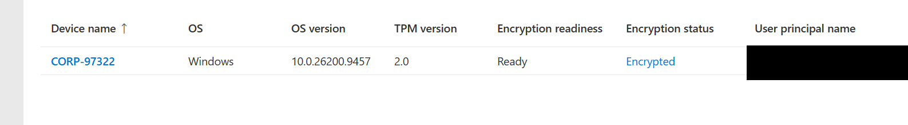
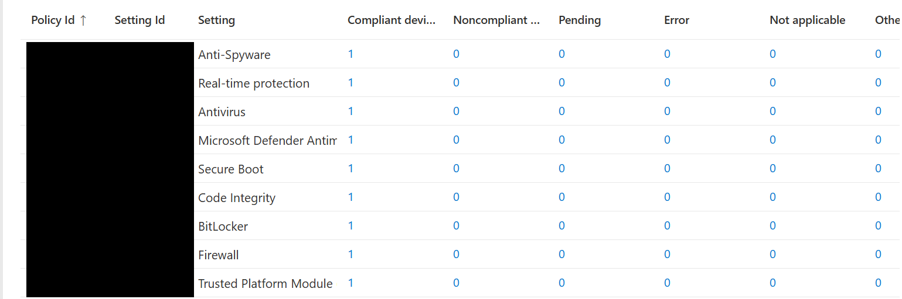
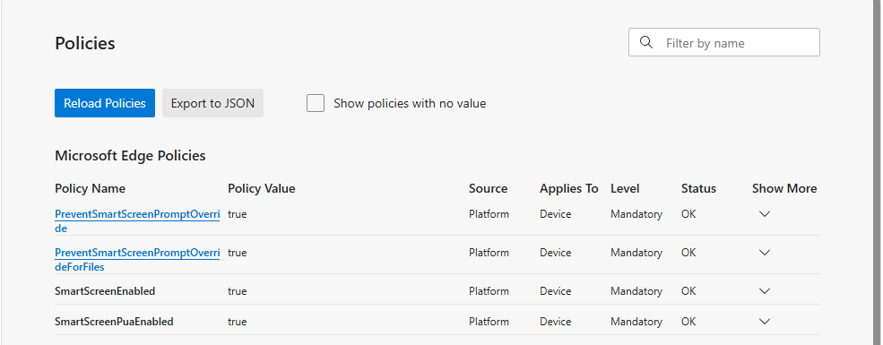

# Tenant rebuild, 15 to 25 September 2026

Rebuild of the `labtenant.onmicrosoft.com` lab after the scripted teardown in `../teardown/`. Same rule
as the teardown: script it where a script teaches something, use the portal where the portal is the
thing being learned.

## Files

| File | Runs on | What |
|---|---|---|
| `00-host-cleanup.ps1` | Host | Frees memory on the Hyper-V host. Preview by default, `-Execute` to apply |
| `01-create-groups.ps1` | Host, Graph | Creates the lab groups as raw Graph requests, dynamic and assigned |
| `02-build-vm.ps1` | Host | Generation 2 machine booting the installer from DVD. **Kept as the route that failed** |
| `02b-apply-image.ps1` | Host | The route that works. Partitions the disk for UEFI, applies Windows with DISM, writes boot files |
| `02c-diagnose-boot.ps1` | Host | Reads the disk read-only and checks each stage of the UEFI boot chain. Changes nothing |
| `02d-write-boot.ps1` | Host | Writes the boot loader onto an existing disk and verifies it landed |
| `03-harvest-hwid.ps1` | **Inside the machine** | Captures the Autopilot hardware hash to a CSV |
| `r.cmd` | **Inside the machine** | One-letter launcher for the script above, so nothing awkward has to be typed |
| `04-fetch-hwid.ps1` | Host | Mounts the machine's disk read-only, unlocks BitLocker with the recovery password if needed, copies the hash out |
| `05-harden-vm.ps1` | Host | Secure Boot, key protector, then TPM, in that order. The order is the point |
| `06-bitlocker-status.ps1` | **Inside the machine**, elevated | BitLocker state, TPM protector PCRs, the policy as received, the BitLocker event log. Never prints the recovery password |
| `07-defender-status.ps1` | **Inside the machine**, elevated | Defender's effective settings against the policy, engine state, and every registry location the policy can sit in |

The hash CSV itself lives in `C:\Intune-Packaging\`, outside the repo.

## The Autopilot chain

| # | Step | Where | What it does |
|---|---|---|---|
| 1 | **Hardware hash** | Inside the machine | `Get-WindowsAutopilotInfo` read the firmware identifiers into a CSV. This is how Microsoft recognises the device before it has a name or a user |
| 2 | **Import** | Intune, Windows Autopilot devices | Registers the hash to the tenant and creates an Entra device object stamped with `[ZTDId]` |
| 3 | **Dynamic group** | Entra ID | `Dyn-Autopilot-Devices`, rule `(device.devicePhysicalIds -any (_ -startsWith "[ZTDId]"))`. Every imported device lands in it automatically |
| 4 | **Deployment profile** | Intune | `APUserDrivenEntraJoin`: user-driven, Entra joined, standard user, name template `CORP-%RAND:5%`. Assigned to the group. Profile status went Not assigned, then Assigned |
| 5 | **Enrollment Status Page** | Intune | `ESPAutopilot`. Holds the user on the progress screen until policies and apps have landed. Overrides the default page for this group |
| 6 | **MDM user scope** | Intune, Automatic Enrollment | All. Decides whose sign-in triggers enrollment into Intune. None means the device joins Entra ID but is never managed, and nothing warns you |
| 7 | **Licence** | Microsoft 365 admin center | Test user `lea.test` given Business Premium, which carries Intune and Entra ID P1 |
| 8 | **Device join permission** | Entra ID, Device settings | "Users may join devices to Microsoft Entra ID" set to All |

## What broke

| # | Failure | Cause | Lesson |
|---|---|---|---|
| 1 | Machine would not boot from the ISO | Generation 2 UEFI DVD boot fails on this host. ISO hash matched Microsoft's, and a Generation 1 machine booted it | Bypass the DVD entirely. Apply the image with DISM from the host |
| 2 | Applied disk still would not boot | `bcdboot` failed and the script never read its exit code, then printed success | A `.exe` fails silently. Check `$LASTEXITCODE`, then check the file actually exists |
| 3 | No copy and paste into the machine | No clipboard at first-run setup. Enhanced session needs a finished install and a signed-in user | `Copy-VMFile` pushes files in. Mounting the disk pulls them out |
| 4 | `Copy-VMFile` refused `System32` | The guest copy service runs with restricted rights | Copy to the root of `C:` instead |
| 5 | Black screen mid-setup | Display output stopped. No crash dump on the disk, so the operating system itself kept running | Connect first, start second, do not let it sit idle |
| 6 | Insufficient system resources on start | 3.1 GB free on the host, machine set to 4 GB static | Dynamic memory, 2 GB start, once Windows is installed |
| 7 | Internet error at sign-in | NordVPN service back to Running, startup Automatic | Same root cause as day 13. Service now set to Manual |
| 8 | `801C03ED` at sign-in | "Users may join devices" was on **Selected**, and the test user was not selected | See below |
| 9 | "To sign in remotely" refusal on connect | Enhanced session is Remote Desktop underneath, and Lea is a standard user outside Remote Desktop Users | `Set-VMHost -EnableEnhancedSessionMode $false` forces the basic console. The proper fix for her is an Intune policy, not a local change |
| 10 | Fetch script reported every file **missing** | Windows had BitLocker-encrypted the disk on its own once the TPM appeared. Every `Test-Path` on a locked volume returns False | "Not found" and "cannot look" are different answers. The script now checks the volume is readable first, and unlocks it with the recovery password if not |

### The `801C03ED` finding

`../teardown/README.md` records that the Entra device settings were returned to defaults during the
teardown. The default for "Users may join devices" is All. On 25 September it was found on
**Selected**.

Either the change was made and never saved, or it was recorded without being checked. Whichever it
was, the log said one thing and the tenant said another, and the tenant won.

The rule that comes out of it: **a log entry is a claim, the live setting is the fact.** Same shape as
failure 2, where the script's own output claimed success. Check the thing itself.

## Where it stands

Lea signed in, the Entra join succeeded, and the Enrollment Status Page completed through all
three stages to a desktop.

**Confirmed 25 September:** the device appears in Intune as `CORP-97322`, from the template
`CORP-%RAND:5%`. The
name template exists only in the Autopilot deployment profile, so this proves the profile drove
setup rather than an ordinary work or school join.



**Confirmed 29 September:** Secure Boot and the TPM are back on through `05-harden-vm.ps1`, and the
machine boots. Windows Security inside the guest reports the security processor present and Secure
Boot on, with "all required certificate updates have been applied". That is the 2023 replacement for
Microsoft's 2011 Secure Boot certificates, which begin expiring in June 2026.

## Compliance

Policy `CP-Windows`, Windows 10 and later, assigned to `Dyn-Autopilot-Devices`:

| Section | Settings required |
|---|---|
| Device Health | BitLocker, Secure Boot, Code Integrity |
| System Security | Firewall, TPM, Antivirus, Antispyware |
| Defender | Microsoft Defender Antimalware, Real-time protection |

Defender for Endpoint machine risk score deliberately left unset: that trial is disabled, so the
check could never pass.

**First evaluation, 29 September: Not compliant**, on a single line of the built-in Default Device
Compliance Policy: "Has a compliance policy assigned". The device had synced before the group
assignment reached it. That line only fails when the tenant setting "Mark devices with no compliance
policy assigned as" is Not compliant, so that setting is on, which is the secure choice. Another
tenant setting that survived the teardown.

**Confirmed 5 October: Compliant.** Per-setting status for `CORP-97322`: all nine settings 1
Compliant, **0 Not applicable**.



The zero matters. A Not applicable line was never checked, and the overall status still reads
Compliant when that happens. The three Device Health lines come from the health report Windows
writes at boot, so this is a second, independent confirmation of the TPM, Secure Boot and the
automatic encryption, separate from what the host and Windows Security reported.

## Defender Antivirus

Policy `ES-Defender-AV`, Endpoint security, Antivirus, assigned to `Dyn-Autopilot-Devices`, created
5 October. Twelve settings: real-time, behaviour, cloud and script scanning, downloads scanned, cloud
block level High, cloud extended timeout 50 seconds, safe samples sent automatically, PUA protection
block, network protection block, local admin merge disabled, definitions checked every 4 hours.

Verified inside the machine with `07-defender-status.ps1`.

**In effect:** all eleven settings that `Get-MpPreference` reports matched. Five of them are not
Windows defaults (cloud block level 2, extended timeout 50, network protection 1, update interval 4,
MAPS 2), so they can only have come from the policy. A value that matches the target only because
it is also the default proves nothing, and that is not the case here.

Engine: running mode **Normal**, so Defender is the active antivirus rather than passive behind
another product. Tamper Protection on.

**Where the policy sits:**

| Setting | Intune's provider key | `Policies\Microsoft\Windows Defender\Policy Manager` | In effect |
|---|---|---|---|
| Real-time, behaviour, cloud, script, download scanning | yes | yes | yes |
| PUA, network protection, samples, update interval | yes | yes | yes |
| DisableLocalAdminMerge | no | yes, 1 | not reported by `Get-MpPreference` |
| CloudBlockLevel, CloudExtendedTimeout | yes | no | yes, 2 and 50 |

The merged key `PolicyManager\current\device\Defender` exists and is empty, unlike BitLocker's,
which held the settings. The two cloud settings are in effect without being in the key Defender
reads, so they are stored somewhere else again. Not traced, so no path is claimed.

**The two vocabularies.** Intune sends `AllowRealtimeMonitoring 1`. Defender reports
`DisableRealtimeMonitoring False`. Same fact, different name, inverted logic. Searching for one name
in the other's output finds nothing.

**The habit:** check the effect first, what the engine is actually doing. Read the registry only to
explain a difference. Each policy area stores settings its own way, so a script that assumes one
location will report false gaps.

`07-defender-status.ps1` also went silent on its first run: it handled "key missing" but not "key
exists and is empty". Silence cannot be told apart from the script never reaching that line. Every
outcome now prints what it is.

Still open: definitions last updated 01:10 on 5 October, before the 4-hour interval arrived. A later
check should show a newer timestamp.

## Edge SmartScreen

Windows Security had flagged "the setting to block potentially unwanted app downloads is turned off".
That switch belongs to Edge, not Defender, so the Defender policy could not set it.

Policy `CFG-Edge-SmartScreen`, settings catalog, category **Microsoft Edge\SmartScreen settings**,
assigned to `Dyn-Autopilot-Devices`, created 6 October:

- Configure Microsoft Defender SmartScreen: Enabled
- Configure Microsoft Defender SmartScreen to block potentially unwanted apps: Enabled
- Prevent bypassing Microsoft Defender SmartScreen prompts for sites: Enabled
- Prevent bypassing of Microsoft Defender SmartScreen warnings about downloads: Enabled

Two traps in the settings picker:

- **Searching "smart screen" with a space** found a different product: Windows SmartScreen for files
  run from Explorer. The one-word "SmartScreen" found Edge's
- **Every Edge setting appears twice**, plain and with "(User)". The plain one applies to the machine
  whoever signs in, which fits a device group. There is also a separate "Default Settings (users can
  override)" category, which is the wrong one for enforcement

Verified in Edge on the device, `edge://policy`:

| Policy | Value | Source | Applies to | Level | Status |
|---|---|---|---|---|---|
| SmartScreenEnabled | true | Platform | Device | Mandatory | OK |
| SmartScreenPuaEnabled | true | Platform | Device | Mandatory | OK |
| PreventSmartScreenPromptOverride | true | Platform | Device | Mandatory | OK |
| PreventSmartScreenPromptOverrideForFiles | true | Platform | Device | Mandatory | OK |



Source **Platform** means delivered through Windows policy, which is how Intune arrives, as opposed
to Edge's own cloud management. Applies To **Device** confirms the machine versions arrived.

Windows Security, App & browser control: the warning is gone and Reputation-based protection shows a
green check. Both potentially unwanted app switches are now policy-controlled: **Block apps** from
`ES-Defender-AV`, **Block downloads** from `CFG-Edge-SmartScreen`.

## Windows encrypted itself

No BitLocker policy exists in the tenant, since the teardown removed them all. After the TPM was added
and Lea signed in, the Windows volume came up BitLocker-locked when mounted on the host:

```
Encryption Method:    XTS-AES 128
Lock Status:          Locked
Key Protectors:       Numerical Password, TPM
```

This is Windows automatic device encryption, not a policy. Three signs:

- **XTS-AES 128** is the automatic default. An Intune BitLocker policy typically sets XTS-AES 256
- **The recovery password was escrowed to Entra ID anyway**, and was visible in Intune under the
  device's Recovery keys. On an Entra-joined device, automatic encryption backs the key up by itself
- **Nobody asked for it.** It switched on once the hardware conditions were met: TPM, Secure Boot,
  and an Entra sign-in

The practical consequence was the lesson in `04-fetch-hwid.ps1`'s own header comment: a host cannot
read a guest's encrypted disk. The recovery password, read from Intune, unlocked it on the host for
the hash fetch. The disk stayed mounted read-only throughout.

Encryption applied by Windows defaults, rather than by policy, is exactly what a BitLocker policy
built later has to take over. The encryption method in particular only applies when a volume is
encrypted, so a policy setting XTS-AES 256 will not convert this volume by itself.

## BitLocker policy takes over

Policy `ES-BitLocker-OS`, Endpoint security, Disk encryption, assigned to `Dyn-Autopilot-Devices`,
created 5 October:

| Setting | Value |
|---|---|
| Require Device Encryption | Enabled |
| Allow Warning For Other Disk Encryption | Disabled, silent encryption gate 1 |
| Allow Standard User Encryption | Enabled, silent encryption gate 2, needed because Lea is a standard user |
| Configure Recovery Password Rotation | Refresh on for Entra ID-joined devices |
| Encryption method, operating system drives | XTS-AES 256 |
| Enforce drive encryption type | Used Space Only |
| Additional authentication at startup | Require TPM. PIN, startup key, key and PIN: Do not allow |
| Recovery | Do not enable BitLocker until recovery information is stored: True. Recovery passwords only, which is what Entra ID stores. Recovery options hidden from users |

The portal labels the recovery settings "AD DS". On an Entra-joined device they write to Entra ID.

### Prediction against result

**Prediction:** the disk is XTS-AES 128 and the policy asks for 256, the encryption method only
applies at the moment of encryption, so the disk stays 128 and the report flags a mismatch.

**On the device**, `manage-bde -status C:` from an elevated session:

```
Conversion Status:    Used Space Only Encrypted, 100%
Encryption Method:    XTS-AES 128
Protection Status:    Protection On
Key Protectors:       Numerical Password (AAD backup), TPM
```

**In Intune**, Encryption report: profile state Succeeded, status detail **"TPM not used for
protection of OS volume, but is required by policy"**.

So the prediction was half right. The disk did stay at 128. The report did not flag the method
mismatch, and flagged a TPM problem instead, which the device contradicts: the TPM is a protector and
protection is on. Still open: whether the report is stale from a check-in before the policy settled,
or Windows is reporting something the protector list does not show.

### What the device actually received

`06-bitlocker-status.ps1`, run inside the machine, reads the device's own record instead of the
report.

**First run said four of the eight settings were "(not present)".** That was my script, not the
device. It asked for value names I assumed, and an empty answer to a wrongly named question looks
exactly like "not set". The second run listed what was really in the key, and showed how Windows
stores administrative-template settings:

- The merged key `PolicyManager\current\device\BitLocker` holds the plain CSP settings as values
  (`RequireDeviceEncryption 1` and so on)
- For template settings it holds only a pointer, `<name>_ADMXInstanceData`, to the key of the source
  that sent it: `PolicyManager\providers\2C56FB1B-...\default\Device\BitLocker`, which is Intune's
  enrollment
- The real value lives there, as an XML fragment

Decoded:

| Setting | Raw value on the device | Means |
|---|---|---|
| EncryptionMethodByDriveType | `EncryptionMethodWithXtsOsDropDown_Name value="7"` | XTS-AES 256. 6 would be XTS-AES 128 |
| SystemDrivesEncryptionType | `OSEncryptionTypeDropDown_Name value="2"` | Used Space Only. 1 would be full |
| SystemDrivesRecoveryOptions | `OSActiveDirectoryBackup_Name value="true"` | Back up recovery information, which on this device means Entra ID |
| SystemDrivesRequireStartupAuthentication | `ConfigurePINUsageDropDown_Name value="0"` | Startup PIN not allowed |

All eight settings arrived, all as configured. The TPM protector is sealed to **PCR 7 and 11**,
"Uses Secure Boot for integrity validation".

So every device-side fact contradicts the report's "TPM not used". And the mismatch Microsoft
documents for exactly this situation, an already-encrypted disk at a different method from policy,
has not appeared in the report either. Both point to the report lagging, which it warns can take up
to 24 hours.

The disk was then decrypted and re-encrypted by the policy, below, which removes the method mismatch
altogether. **Test: re-read the report after 24 hours.** Expected now: no status details at all. If
the TPM message is still there with the disk freshly encrypted under the policy, the lag explanation
is wrong.

**Result, 6 October:** profile state Succeeded, status details **Success**. The TPM message is gone.

What that does and does not prove: between the two readings, two things changed, the time elapsed
and the encryption itself, including a new TPM protector created by the policy. Either could have
cleared the message. So the result is **consistent with** the report having lagged, and does not
prove it. A clean test would have waited 24 hours before re-encrypting. Changing two variables at
once is what made this one inconclusive.

### Decrypt and let the policy re-encrypt

Microsoft's documented fix for a disk encrypted before the policy, at a different method, is to
decrypt and let the policy encrypt again. Done on 5 October. It also disposed of a second exposed
key: the rotated recovery password had appeared on screen too, from a `manage-bde -protectors -get`
run after the rotation.

**Before starting:** NordVPN was found running on the host again, its service back on Automatic
although it had been set to Manual. With "do not enable until recovery information is stored", a
broken DNS path would have left the disk decrypted indefinitely, because the key backup has to
reach Entra ID first. The log already held a 3 October timeout reaching Entra ID. Stopped, then DNS
to `login.microsoftonline.com` confirmed from inside the machine.

`Disable-BitLocker -MountPoint C:`, not `Suspend-BitLocker`. Suspend leaves the disk encrypted with
the key stored in the clear until resume or restart, which is what firmware updates need. Disable
fully decrypts and removes every protector.

Observed:

- **Protection Status went to Off the moment decryption started**, with the disk still 100%
  encrypted. From that second the disk is effectively unprotected
- Decryption took about six minutes. Afterwards: `FullyDecrypted`, method `None`, protectors `{}`
- Restarted, so the boot-time health report would record BitLocker off
- **No sync, no click.** About four minutes after the restart: `EncryptionInProgress`, `XtsAes256`.
  Lea, a standard user, saw no prompt

The BitLocker Management log, oldest first:

| Time | Event | |
|---|---|---|
| 14:19 | 770 | Decryption started |
| 14:26 | 796 | Software-based encryption, not the drive's hardware encryption |
| 14:26 | 775 | New recovery password protector created |
| 14:26 | **845** | **Recovery information backed up to Entra ID** |
| 14:26 | 892 | Key sealed to the TPM, PCR 7 and 11, source Secure Boot |
| 14:26 | 775 | New TPM protector created |
| 14:26 | **768** | **Encryption started, XTS-AES 256** |

**845 before 768**: the key was in Entra ID before any sector was encrypted. That ordering is the
whole purpose of "Do not enable BitLocker until recovery information is stored".

Result: `FullyEncrypted`, `XtsAes256`, protection On, both protectors new. Nothing from the old
encryption or either exposed key survives.

### Compliance followed the boot, not the disk

| Moment | Disk | `CP-Windows`, BitLocker line |
|---|---|---|
| Booted after decryption | Unencrypted at boot, then re-encrypted within minutes | **Not compliant**, still showing while the disk had been fully encrypted for twenty minutes |
| Restarted after re-encryption, waited | Encrypted | **Compliant** |

The BitLocker compliance check reads the health report Windows writes at boot. A sync does not
refresh it, only a restart does, and Intune then evaluates it on its own schedule. A check made a few
minutes after the restart still showed Not compliant. Roughly half an hour later it read Compliant.

The production consequence: with Conditional Access requiring a compliant device, and the
noncompliance action set to Immediately, decrypting a user's machine locks them out of Microsoft 365
until a later boot has been reported and evaluated.

### The recovery key was exposed, so it was rotated

`manage-bde -protectors -get C:` prints the full 48-digit recovery password. A screenshot of it went
into the working conversation, so the key was treated as spent and rotated from Intune: device,
BitLocker key rotation. This is the action the rotation setting in the policy enables. The device
reported a new recovery password protector ID afterwards.

Checked with a command that shows IDs without the secret:

```powershell
(Get-BitLockerVolume C:).KeyProtector | Select KeyProtectorId, KeyProtectorType
```

`manage-bde -protectors -get` is the right tool for diagnosis and the wrong one in front of a screen
share.

## The TPM changed the hardware hash

Hash harvested before and after the TPM was added, compared byte for byte:

| | Before TPM | After TPM |
|---|---|---|
| Serial number | `<serial-redacted>` | unchanged |
| Hash length | 4000 characters, 3000 bytes | 4000 characters, 3000 bytes |
| Bytes carrying data | 766 | 1112 |
| Zero padding | 2234 | 1888 |
| Bytes that differ | | 770 of 3000, from byte 2 onward |

The hash is a fixed-size 3000-byte container, mostly zero padding when components are missing. That
padding is the long run of `A` characters at the end of the Base64 text. Adding the TPM filled 346
more bytes. Decoding which fields changed needs Microsoft's `oa3tool`, which was not run, so the claim
here stops at "the TPM added data and the hash changed".

The early first difference, at byte 2, is consistent with a length field in the header changing and
shifting everything after it. That is inference, not decoded.

Intune still holds the **pre-TPM** hash.

Still open:

- **Does Autopilot still recognise the machine?** Test by Autopilot Reset and see whether the
  profile applies again. Not guessed
- Configuration profiles still to build: firewall, update rings, memory integrity. BitLocker,
  Defender Antivirus and Edge SmartScreen are done, above

## Licensing deadline

The Business Premium trial was due to end on 27 September 2026. **Extended once, on 25 September, to
27 October 2026.** Free, recurring billing left Off, and the extension option is now greyed out, so
it cannot be extended again.

It supplies Intune and Entra ID P1 to every user, and automatic enrollment, dynamic groups and
Conditional Access all depend on Entra ID P1. One paid Intune Plan 1 seat exists, valid to 20 August
2027, and does not cover Entra ID P1.
